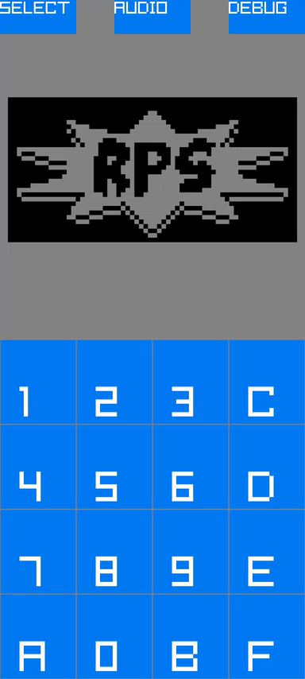

# C3 Chip8



A CHIP-8 emulator for Android, written in [C3](https://c3-lang.org) using [Raylib](https://www.raylib.com).

The emulator supports CHIP-8 with a selection of quirks. Some games may have bugs or behave unexpectedly depending on the quirk configuration.

## Building

Make sure the following environment variables are set:

- `ANDROID_SDK_HOME` — path to the Android SDK
- `ANDROID_NDK` — path to the Android NDK

Then run:

```sh
make apk
```

The signed APK will be at `build/C3Chip8_signed.apk`.

## Running

Install the APK on an Android device, open the app and select a game from the list.

## ROMs

The bundled ROMs are sourced from [chip8Archive](https://github.com/JohnEarnest/chip8Archive) and are licensed under CC0.

## Acknowledgments

This project uses [Raylib](https://www.raylib.com), licensed under the zlib/libpng license.  
An acknowledgment in the product documentation is appreciated but not required — considered done here.
